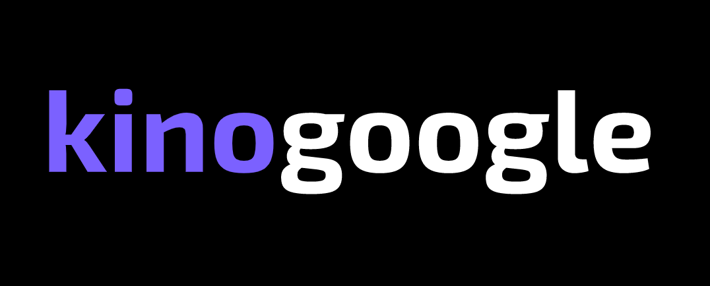

<a id="readme-top"></a>

[![Forks][forks-shield]][forks-url]
[![Stargazers][stars-shield]][stars-url]
[![Issues][issues-shield]][issues-url]
[![LinkedIn][linkedin-shield]][linkedin-url]


<!-- PROJECT LOGO -->
<br />
<div align="center">
  <a href="https://github.com/OlgaUsovich/kinogoogle">
    
  </a>

  <h3 align="center">kinogoogle</h3>

  <p align="center">
    React App. The best graduate work. My start in the direction of frontend development
    <br />
    <br />
    <a href="https://olgausovich.github.io/kinogoogle/">View Demo</a>
    ·
    <a href="https://github.com/OlgaUsovich/kinogoogle/issues/">Report Bug</a>
    ·
    <a href="https://github.com/OlgaUsovich/kinogoogle/issues/">Request Feature</a>
  </p>
</div>


<!-- TABLE OF CONTENTS -->
<details>
  <summary>Table of Contents</summary>
  <ol>
    <li>
      <a href="#about-the-project">About The Project</a>
      <ul>
        <li><a href="#built-with">Built With</a></li>
      </ul>
    </li>
    <li>
      <a href="#getting-started">Getting Started</a>
      <ul>
        <li><a href="#installation">Installation</a></li>
      </ul>
    </li>
    <li><a href="#usage">Usage</a></li>
    <li><a href="#roadmap">Roadmap</a></li>
    <li><a href="#contact">Contact</a></li>
  </ol>
</details>


<!-- ABOUT THE PROJECT -->
## About The Project

[![Product Name Screen Shot][product-screenshot]](https://github.com/OlgaUsovich/kinogoogle/)

This is my graduate work on a front-end development course. I really appreciate the knowledge and skills I've got during working on this project. 

Here's why:
* I've got a good practice in working with API
* I've learned how to work with firebase authentication
* I've understood that there are thousands of libraries that can help in any issue and learned how to use them on specific examples 
* It was a great opportunity to practice in creating and solving issues

Of course, this project is not so ideal or professional. That's why I keep improving it. You may also help me by opening an issue so I can solve another interesting problem and get some new experience from this.

<p align="right">(<a href="#readme-top">back to top</a>)</p>


### Built With

* [![Typescript][typescriptlang.org]][typescript-url]
* [![React][React.js]][React-url]
* [![Axios][axios-http.com]][axios-url]
* [![Firebase][firebase.google.com]][firebase-url]
* [![Redux Toolkit][redux-toolkit.js.org]][redux-url]
* [![React Hook Form][react-hook-form.com]][react-hook-form-url]
* [![styled-components][styled-components]][styled-components-url]
* [![React Router][reactrouter.com]][react-router-url]
* [![Framer Motion][framer.com]][framer-url]
* [![React Select][react-select.com]][react-select-url]
* [![Redux Persist][github.com/rt2zz/redux-persist]][persist-url]

<p align="right">(<a href="#readme-top">back to top</a>)</p>


<!-- GETTING STARTED -->
## Getting Started

Just install the project to see how it works.

### Installation

1. Clone the repo
   ```sh
   git clone https://github.com/OlgaUsovich/kinogoogle.git
   ```
2. Install NPM packages
   ```sh
   npm install
   ```

<p align="right">(<a href="#readme-top">back to top</a>)</p>


<!-- USAGE EXAMPLES -->
## Usage

This is a simple app to view information about movies. Movies can be filtered or found in search. 

[![Product Name Screen Shot][filters-screenshot]](https://github.com/OlgaUsovich/kinogoogle/)

Also you can veiw the full info about movie.

[![Product Name Screen Shot][movie-screenshot]](https://github.com/OlgaUsovich/kinogoogle/)

There is authentication block where you can sign up to be able to add movies to favorites.

[![Product Name Screen Shot][sign-up-screenshot]](https://github.com/OlgaUsovich/kinogoogle/)

You can change authentication data in settings block.

[![Product Name Screen Shot][settings-screenshot]](https://github.com/OlgaUsovich/kinogoogle/)

<p align="right">(<a href="#readme-top">back to top</a>)</p>


<!-- ROADMAP -->
## Roadmap

- [x] Add page for empty cards list
- [ ] Add Recomendations on movie page
- [ ] Improve light theme colors
- [ ] Add pagination on favorites page

<p align="right">(<a href="#readme-top">back to top</a>)</p>

<!-- CONTACT -->
## Contact

Olga Usovich - [github.com/OlgaUsovich/](https://github.com/OlgaUsovich/) - olya.usovich.17@mail.ru

Project Link: [https://github.com/OlgaUsovich/kinogoogle/](https://github.com/OlgaUsovich/kinogoogle/)

<p align="right">(<a href="#readme-top">back to top</a>)</p>


<!-- MARKDOWN LINKS & IMAGES -->
[forks-shield]: https://img.shields.io/github/forks/OlgaUsovich/kinogoogle.svg?style=for-the-badge
[forks-url]: https://github.com/OlgaUsovich/kinogoogle/network/members
[stars-shield]: https://img.shields.io/github/stars/OlgaUsovich/kinogoogle.svg?style=for-the-badge
[stars-url]: https://github.com/OlgaUsovich/kinogoogle/stargazers
[issues-shield]: https://img.shields.io/github/issues/OlgaUsovich/kinogoogle.svg?style=for-the-badge
[issues-url]: https://github.com/OlgaUsovich/kinogoogle/issues
[linkedin-shield]: https://img.shields.io/badge/-LinkedIn-black.svg?style=for-the-badge&logo=linkedin&colorB=555
[linkedin-url]: https://www.linkedin.com/in/volha-usovich-758119205
[product-screenshot]: readme/home.png
[movie-screenshot]: readme/movie.png
[sign-up-screenshot]: readme/sign-up.png
[settings-screenshot]: readme/settings.png
[filters-screenshot]: readme/filters.png
[typescriptlang.org]: https://img.shields.io/badge/-Typescript-blue?style=for-the-badge&logo=typescript&logoColor=white
[typescript-url]: https://www.typescriptlang.org/
[React.js]: https://img.shields.io/badge/React-20232A?style=for-the-badge&logo=react&logoColor=61DAFB
[React-url]: https://reactjs.org/
[axios-http.com]: https://img.shields.io/badge/-axios-671ddf?style=for-the-badge&logo=axios&logoColor=white
[axios-url]: https://axios-http.com/ru/docs/intro
[firebase.google.com]: https://img.shields.io/badge/-firebase-5f6368?style=for-the-badge&logo=firebase&logoColor=orange
[firebase-url]: https://firebase.google.com/docs/
[redux-toolkit.js.org]: https://img.shields.io/badge/-redux--toolkit-764abc?style=for-the-badge&logo=redux&logoColor=white
[redux-url]:https://redux-toolkit.js.org/
[react-hook-form.com]: https://img.shields.io/badge/-react--hook--form-1e2a4a?style=for-the-badge&logo=react-hook-form&logoColor=ec5990
[react-hook-form-url]: https://react-hook-form.com/
[github.com/rt2zz/redux-persist]: https://img.shields.io/badge/-redux--persist-persist?style=for-the-badge
[persist-url]: https://github.com/rt2zz/redux-persist#readme
[styled-components]: https://img.shields.io/badge/-styled--components-35495E?style=for-the-badge&logo=styled-components&logoColor=pink
[styled-components-url]: https://styled-components.com/
[framer.com]: https://img.shields.io/badge/-framer--motion-DD0031?style=for-the-badge&logo=framer&logoColor=black
[framer-url]: https://www.framer.com/
[react-select.com]: https://img.shields.io/badge/-react--select-FF3E00?style=for-the-badge
[react-select-url]: https://react-select.com/home
[reactrouter.com]: https://img.shields.io/badge/-react--router-563D7C?style=for-the-badge&logo=react-router&logoColor=white
[react-router-url]: https://reactrouter.com/